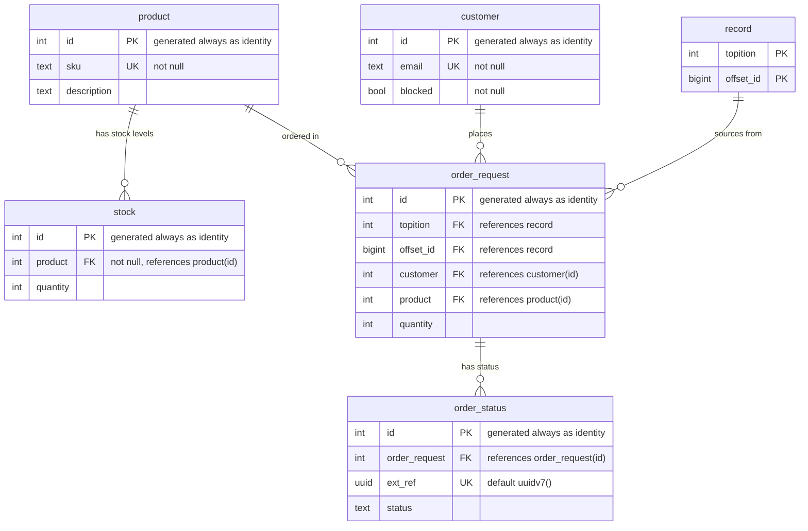

| Section | Description |
|--------|-------------|
| [Transactional Outbox Replacement](#transactional-outbox-replacement) | High-level overview of the pattern |
| [The Steps](#the-steps) | The step-by-step schema, triggers, and atomic order processing logic |
| [How To Run This Example](#how-to-run-this-example) | Running the full working example end-to-end |

---

# Transactional Outbox Replacement

In [Tansu](https://github.com/tansu-io/tansu), the storage engine is used to store both the messages and the Kafka-compatible metadata.
That same storage engine (the database) can also store the business entities related to the messages.

If that is the case,
then using lightweight triggers allow us to react to Kafka messages by performing checks,
updating a business entity database table,
and producing a resulting Kafka message all in a **single, atomic transaction**. 

For example, in an online shop, we could:
- check stock availability
- check whether the customer is of good standing
- persist the acceptance of the order
- update the new (reduced) stock
- **and** produce a message to a Kafka topic (signaling that the order has been accepted)
all in a single, atomic transaction.

The following 20-line SQL pseudocode roughly illustrates this:

```sql
update stock
set quantity = quantity - order_request.quantity
from customer c
where
stock.product = order_request.product
and c.id = order_request.customer
and not(c.blocked)
and stock.quantity >= order_request.quantity;

if FOUND then
    -- A row was updated.
    -- This means we had enough stock and customer is of good standing,
    -- Accept the order:
    --   1. insert a row into order_status as 'accepted'
    --   2. queue a message on the 'order_accepted' topic with an order reference
    insert into order_status (order_request, status)
    values (new.id, 'accepted')
    returning order_status.ext_ref into ext_ref;
    
    -- produce a message to the order 'accept_accepted' topic:
    perform produce_message('order_accepted', partition_num, null, format('{"ref": "%s"}', ext_ref));
else
    -- No row was updated.
    -- We either did not have enough stock, or the customer is of bad standing.
    -- Reject the order by only updating its status
    insert into order_status (order_request, status)
    values (new.id, 'rejected');
end if;
```

> 💡 If you were do to this with regular Kafka, you'd have to use something like the [Transactional Outbox](https://microservices.io/patterns/data/transactional-outbox.html) - a pattern typically used when a command must update the database and send messages in an atomic way (in order to avoid data inconsistencies and bugs).

In Tansu, updating a business entity and sending a message atomically is just an `UPDATE` and `INSERT` inside a regular database transaction (atomic by definition).
No more complexity.  No need for other moving parts that need to be monitored 24/7, with a latency inducing service polling an `OUTBOX` table forwarding messages to the broker.

# The Steps

Let's use an **online shop** as an example, a **customer** can place an **order** for
a **product** by producing a message to the *order_json* topic (for customers using JSON)
or *order_xml*  topic (for customers using XML): 

## Order

An order is placed by producing a JSON message onto the `order_json` topic,
with the customer's `email`, the `sku` being ordered and the `quantity`:

```json
{"email": "a@b.com", "sku": "SK01", "quantity": 1}
```

An order can also be placed by producing a XML message onto the `order_xml` topic,
with the customer's `email`, the `sku` being ordered and the `quantity`:

```xml
<order>
  <email>a@b.com</email>
  <sku>SK01</sku>
  <quantity>1</quantity>
</order>
```

## Database Schema

The **online shop** has the following main entities database entities:

- **product**: Stores available products with SKU and description
- **stock**: Tracks inventory quantity for each product
- **customer**: Registered customers with email and blocked status
- **order_request**: Orders from the "order_json" and "order_xml" topics, linking customers to products
- **order_status**: Status tracking for each order with external reference UUID

We also need to reference one entity from the **tansu** schema:

- **record**: Contains Kafka messages that have been produced to any topic, with their topic, partition and message offset

### ER Diagram



### DDL

The products available are represented by the `product` table:

```sql
create table product (
    id int generated always as identity primary key,
    sku text not null,
    unique (sku),
    description text
);
```

Each `product` has an available `stock` quantity:

```sql
create table stock (
    id int generated always as identity primary key,
    product int references product(id) not null,
    quantity int
);
```

A `customer` is identified by their `email` and can only place orders from the shop if they are not `blocked`:

```sql
create table customer (
    id int generated always as identity primary key,
    email text not null,
    unique (email),
    blocked bool not null
);
```

An `order_request` represents a JSON or XML **order message**, with the `topic`, `partition`
and message `offset_id` referencing the original Kafka `record`:

```sql
create table order_request (
    id int generated always as identity primary key,
    topition int,
    offset_id bigint,
    foreign key (topition, offset_id) references record (topition, offset_id),
    customer int references customer(id),
    product int references product(id),
    quantity int
);
```

> 💡 Tansu uses a `record` table to store messages that are produced to the broker. The table is [partitioned](https://www.postgresql.org/docs/current/ddl-partitioning.html) by `topic` and `partition` effectively making each a separate table under the hood.

## Business Logic Trigger

We can use a [trigger](https://www.postgresql.org/docs/18/sql-createtrigger.html)
on Tansu's `record` table to populate the `order_request` table as each record is
inserted inside a particular topic.
In our example, this input topic is called `order_json` or `order_xml`. 

1. Create the function with the appropriate `order_request` conditional logic

```sql
-- Writing to the `order_json` or `order_xml` topics will populate the `order_request` table
-- Writing to any other topic will be a no-op
create or replace function on_tansu_record_insert() returns trigger as $$
declare
    topic_name text;
begin
    -- the topic_name of the message being inserted:
    select t.name into topic_name
    from topic t
    join topition tp on tp.topic = t.id
    where tp.id = new.topition;

    if topic_name = 'order_json' then
        declare
            order_email text;
            order_sku text;
            order_quantity int;
        begin
            -- extract the JSON message data
            order_email = json(new.v)->>'email';
            order_sku = json(new.v)->>'sku';
            order_quantity = (json(new.v)->>'quantity')::int;

            -- insert the extracted data into an order request
            insert into order_request (topition, offset_id, customer, product, quantity)
            select new.topition, new.offset_id, c.id, p.id, order_quantity
            from customer c, product p
            join stock s on s.product = p.id
            where c.email = order_email
            and p.sku = order_sku;
        end;
    elsif topic_name = 'order_xml' then
        declare
            document xml;
            order_email text;
            order_sku text;
            order_quantity int;
        begin
            -- extract the XML message data
            document = xmlparse (content convert_from(new.v, 'utf-8'));
            order_email = (xpath('order/email/text()', document))[1];
            order_sku = (xpath('order/sku/text()', document))[1];
            order_quantity = (xpath('number(order/quantity/text())', document))[1]::text::int;

            -- insert the extracted data into an order request
            insert into order_request (topition, offset_id, customer, product, quantity)
            select new.topition, new.offset_id, c.id, p.id, order_quantity
            from customer c, product p
            join stock s on s.product = p.id
            where c.email = order_email
            and p.sku = order_sku;
        end;
    end if;
    return new;
end;
$$ LANGUAGE plpgsql;
```

2. Attach the function via a trigger on `INSERT` to the Tansu `record` table:

```sql
create trigger tansu_record_insert
after insert on record
for each row execute function on_tansu_record_insert();
```

3. We can use another [trigger](https://www.postgresql.org/docs/18/sql-createtrigger.html) on the `order_request` table.
This can atomically update the stock level, check the good standing of the customer **and** produce a message to the `accept` topic to signal the success:

```sql
create or replace function on_order_request_insert() returns trigger as $$
begin
    -- accept the order if there is sufficient stock
    -- and the customer is of good standing
    update stock
    set quantity = quantity - new.quantity
    from customer c
    where
    stock.product = new.product
    and c.id = new.customer
    and not(c.blocked)
    and stock.quantity >= new.quantity;

    if FOUND then
        declare
            partition_num int;
            ext_ref uuid;
        begin
            -- use the same partition on the 'accepted' topic:
            select tp.partition into partition_num
                from
                    topition tp
                where
                    tp.id = new.topition;

            -- accept the order creating a public order reference:
            insert into order_status (order_request, status)
            values (new.id, 'accepted')
            returning order_status.ext_ref into ext_ref;

            -- produce message to the 'accept' topic:
            perform tansu_produce_message('accept', partition_num, null, format('{"ref": "%s"}', ext_ref::text)::bytea);
        end;
    else
        insert into order_status (order_request, status)
        values (new.id, 'rejected');
    end if;
    return new;
end;
$$ LANGUAGE plpgsql;
```

4. Add the trigger on `INSERT` to the `order_request` table:

```sql
create trigger order_request_insert
after insert on order_request
for each row execute function on_order_request_insert();
```

If there is a sufficient stock available for the `sku` **and** the customer is in good standing (not `blocked`), a message will now be produced to the `accept` topic containing a `ref` for the order:

```json
{"ref": "019bacac-2841-7982-998c-6a7b8d2d1ac4"}
```
If there is insufficient stock or the customer is not of good standing, **no** message will be produced to the `accept` topic.

---

# How To Run This Example

This repository contains a working example of:

- the database schema outlined above for the `shop`
- some sample data, including a customers of good and bad standing
- the triggers on the `record` and `order_request` tables

Prerequisites:
- **[docker](https://www.docker.com)**, using [compose.yaml](compose.yaml) which runs [tansu](https://tansu.io) and [PostgreSQL](https://www.postgresql.org)
- **[just](https://github.com/casey/just)**, a handy way to save and run project-specific commands
- **[uv](https://github.com/astral-sh/uv)**, an extremely fast Python package and project manager used to run the examples

[justfile](./justfile) contains recipes to run the example.

Once you have the prerequisites installed, clone this repository:

```shell
git clone https://github.com/tansu-io/example-pg-tx-outbox.git
cd example-pg-tx-outbox
```

To start [PostgreSQL](https://www.postgresql.org) and [tansu](https://tansu.io) running as docker containers:

```shell
just
```

## Consumer

Read accepted orders from the `order_accepted` topic using **either**:

A consumer using the [Python asyncio client for kafka](https://github.com/aio-libs/aiokafka) reading accepted orders from the `order_accepted` topic

```shell
just consumer-python
```

**Or**, a consumer using the Kafka Java client CLI reading accepted orders from the `order_accepted` topic:

```shell
just consumer-java
```

## Producer

In another shell, place an order with a customer of good standing (with [Python asyncio client for kafka](https://github.com/aio-libs/aiokafka)):

```shell
just good-purchase-json
```

Or using, the Kafka Java client CLI with:

```shell
just good-purchase-xml
```

You can continue placing purchases with a customer of good standing under the stock for the product runs out. Over of the `consumer` shell you should see output similar to:

```shell
consumed:  accept 0 0 None b'{"ref": "019bad18-16a9-7e0e-b759-0b68d6566133"}' 1768135595686
```

Where `ref` is an order reference that can be given to the customer.
You can continue placing orders for the customer of good standing until the stock runs out (6 in total).
At that point, no further messages should be produced to the `accept` topic.

You can also place an order from a blocked customer using ([Python asyncio client for kafka](https://github.com/aio-libs/aiokafka)):

```shell
just blocked-purchase-json
```

Or using the Java CLI with XML using:

```shell
just blocked-purchase-xml
```

There should be no output on the `order_accepted` topic for that customer.

## Database

View the order requests:

```shell
just select-order-request
```

The status of orders:

```shell
just select-order-status
```

The list of products:

```shell
just select-product
```

Stock level of products:

```shell
just select-stock
```

---

Want to try it out for yourself? Clone (and ⭐) Tansu at [https://github.com/tansu-io/tansu](https://github.com/tansu-io/tansu).
